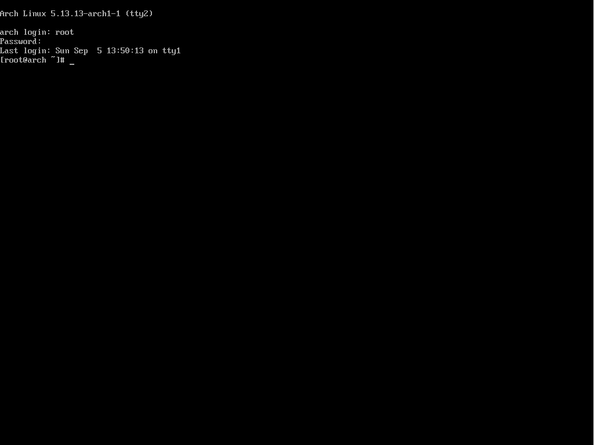
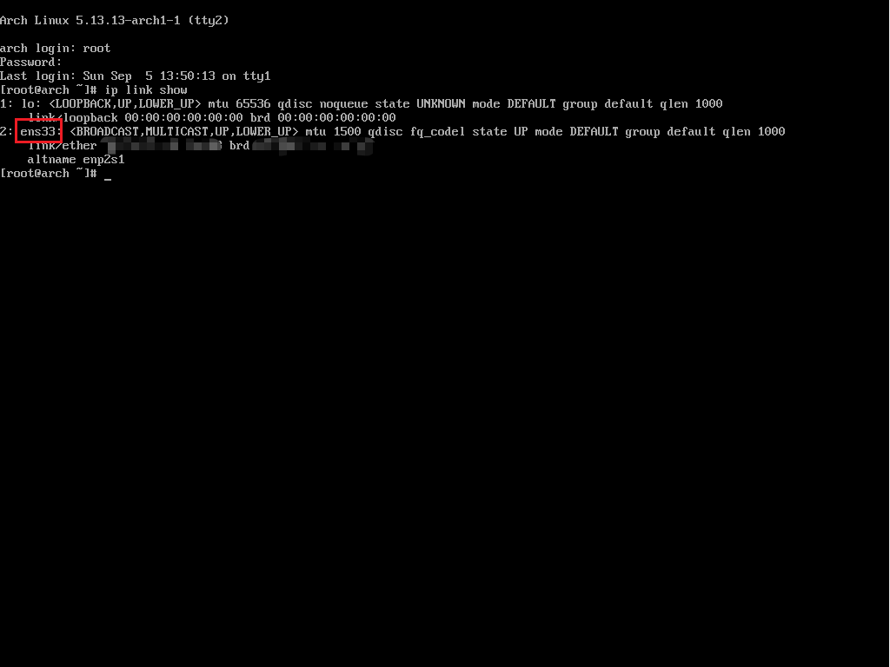
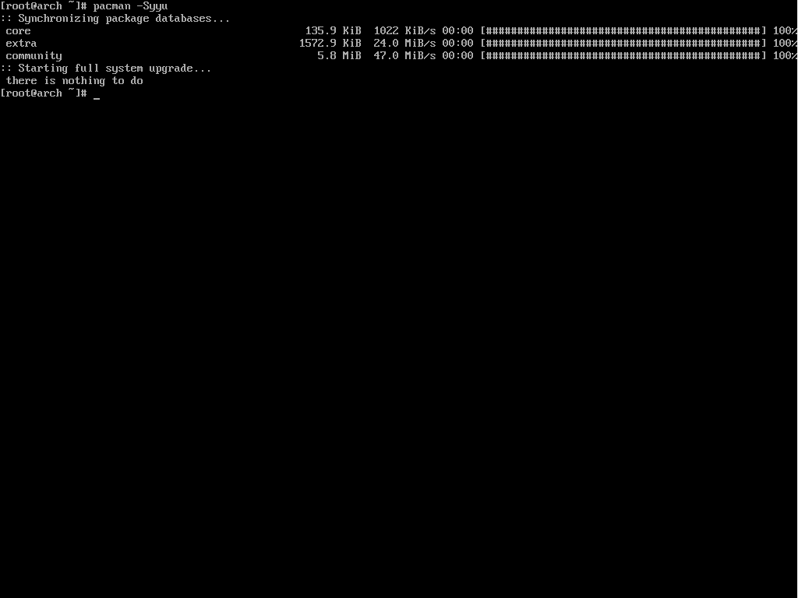
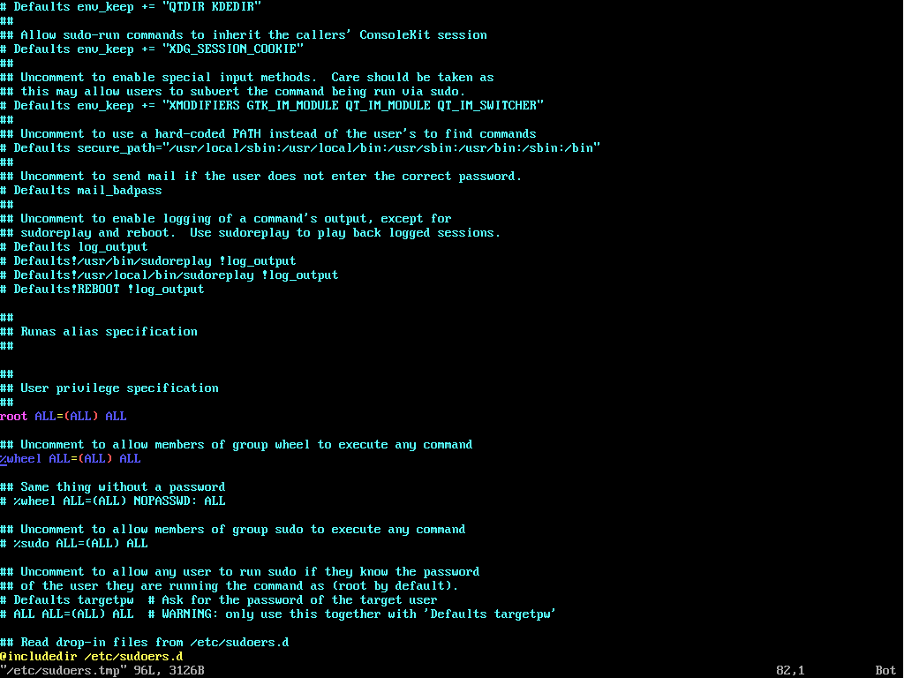
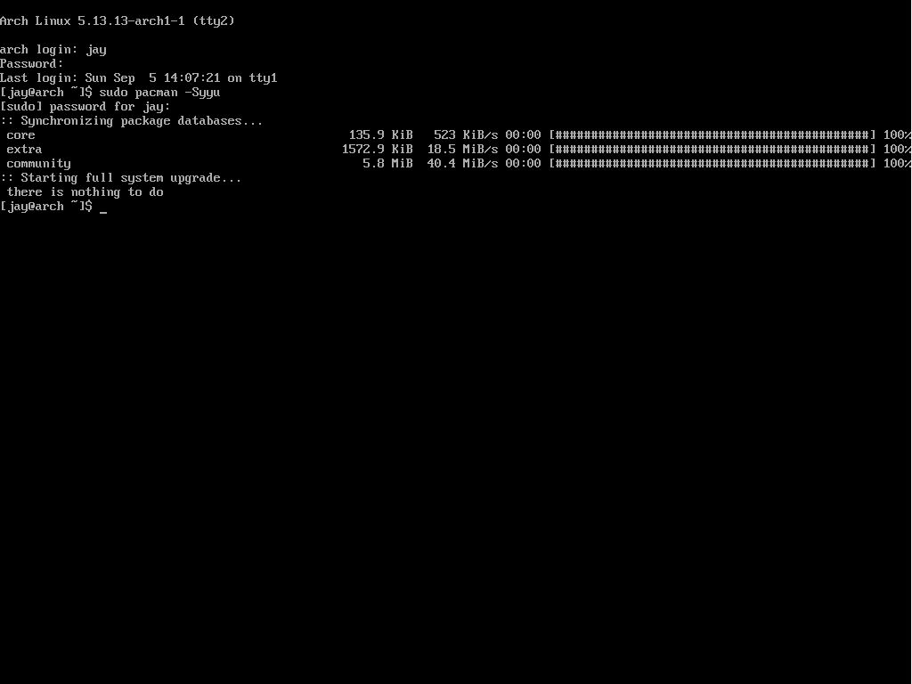
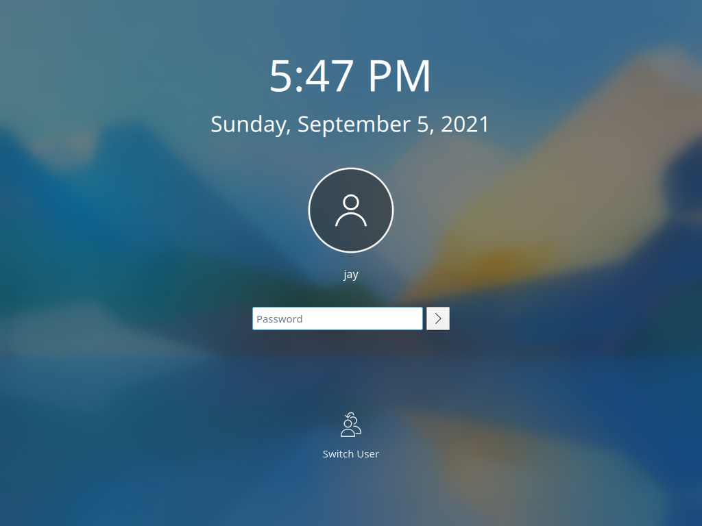
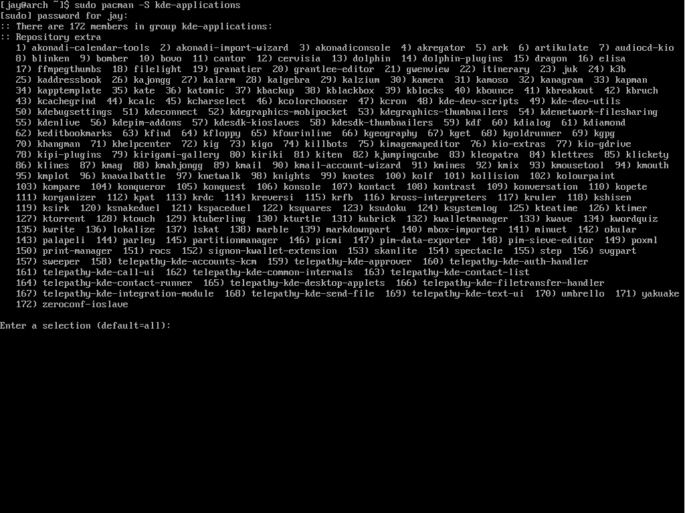
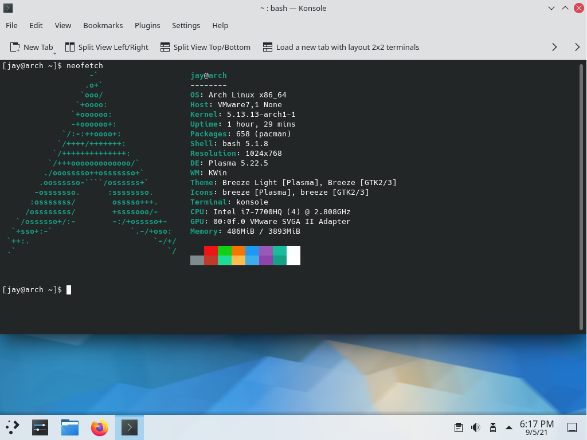
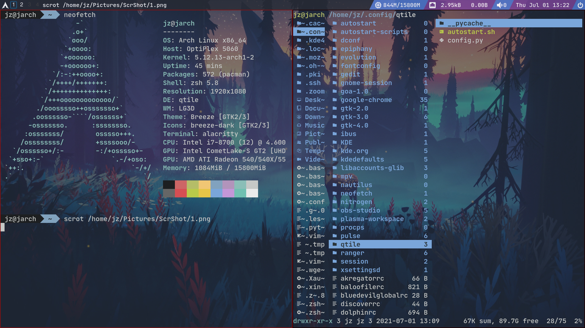

# 一些准备工作

## **参考**
- [官方Wiki](https://wiki.archlinux.org/)
- Bilibili up主：[TheCW](https://space.bilibili.com/13081489) -> [Arch Linux安装视频](https://www.bilibili.com/video/BV1q7411s7LS)

## 联网（重要）

这一小节接[上一篇教程](https://wangjianze96.github.io/2021/07/02/arch-install/)。接下来的所有操作都已默认你已经安装好了Arch Linux，如果你还没有安装，可以参考上一篇教程进行安装。

当我们开机后会进入到下图中的界面，一个纯命令行交互界面。如果你不需要一个图形化界面，那么只需要把接下来联网的步骤做完，你的系统就已经准备好了。



因为在之前的安装过程中，我们并没有创建新的用户，只是创建了`root`的密码，所以登录时只能以`root`身份登录系统。这时如果直接输入`pacman -Syyu`的话，系统会报错因为我们没有连接到互联网。为了让系统连接到网络，需要每次开机都输入一次`dhcpcd &`，这样很麻烦而且效率很低。所以为了让每次开机时系统自动连接到网络，我们需要按照以下步骤来让系统每次开机时自动运行`dhcpcd`。
```
ip link show
```
输入上面的命令后，我们可以看到我们系统的网络接口名称，我的如下图所示，接口名称为`ens33`



接下来，我们创建一个名为`dhcpcd@ens33`的服务，并在每次开机时自动启动这个服务，输入以下命令：
```
systemctl enable dhcpcd@ens33.service
```
注意，将上面的`ens33`替换成你自己的接口名称。这时如果重启系统的话，利用`ping www.baidu.com`来查看，我们就会看到此时系统已经连到网络了。不想重启的话，可以输入下面的命令启动这一服务：
```
systemctl start dhcpcd@ens33.service
```
这时再输入`pacman -Syyu`，系统就可以正常安装其他包和更新了。



## 创建低权限用户

创建较低权限用户的原因是`root`权限过高，对于不太熟悉Linux系统的用户，在输入一些对系统有较大改动的命令时，很容易出现误操作，比如`rm -rf /`。使用较低权限用户可以有效避免这些问题。首先安装一下必要的工具：
```
pacman -S base-devel
```
使用`useradd`添加一个新的用户：
```
useradd jay -m -G wheel
```
其中`-m`是为用户创建`home`目录，`-G`是把用户添加进组，上面的命令是将用户`jay`添加进名为`wheel`组。但此时这个用户还没有权限对系统作出改动。我们需要编辑`/etc/sudoers.tmp`文件。这里我用`vim`进行编辑。找到`# %wheel ALL=(ALL) ALL`这一行，删掉前面的`#`，保存并退出。



这时我们从`root`用户退出，已创建的新用户登录，输入`sudo pacman -Syyu`，我们就会看到这个新的用于再输入密码后也可以对系统作出改动了。



# 安装KDE-Plasma

## 安装display server

主流的display server有两个，一个是[Xorg](https://wiki.archlinux.org/title/Xorg)（X11），另一个时[Wayland](https://wiki.archlinux.org/title/Wayland)。Wayland的主要目标时成为Xorg的继任者。可以根据个人需求安装。本篇使用Xorg。
```
sudo pacman -S xorg
```

## 安装plasma-desktop以及sddm
```
sudo pacman -S plasma
```
注意，此命令其实只安装了`plasma-desktop`，一些常用的KDE应用并没有被安装。

`sddm`是一个[display manager](https://wiki.archlinux.org/title/Display_manager)。通常被用于系统的login，例如下图：



输入下面的命令安装`sddm`
```
sudo pacman -S sddm
```
和`dhcpcd`一样，此时`sddm`并不会在下次开机时自动运行，所以，类似`dhcpcd`，我们也要创建一个名为`sddm.service`的服务并告知系统我们需要在每次开机时自动运行这个服务。
```
sudo systemctl enable sddm.service
```

## 安装kde-applications

```
sudo pacman -S kde-applications
```
输入这个命令后，我们可以看到以下输出：



可以看到，pacman给出了所有会安装的包，如果你不像我一样只想要一个小一些的系统的话，就可以直接默认全选了。因为是在笔记本上新建的虚拟机，我没有给Arch分配很大的空间。所以我这里只选了几个必须的包：
- (13 & 14) dolphin：kde的文件管理器
- (21) gwenview：kde的图片查看器
- (106) konsole：kde的终端模拟器
- (142) okular：kde的PDF阅读器
注：因为版本更新，在安装时软件包的编号可能会变化，输入你想安装的包的编号就好。

当然，还差一个浏览器：
```
sudo pacman -S firefox
```
注：google-chrome不在Arch Linux的官方库中，[AUR](https://aur.archlinux.org/)中有相关的包，可以参考[官方文档](https://aur.archlinux.org/packages/google-chrome/)进行安装。

以上步骤做好后，重启系统，我们就有一个KDE桌面的Arch Linux了。



# 后记

本教程只是引导安装了KDE-plasma桌面，Arch Linux还有其他有意思的桌面，比如Gnome和XFCE。如果有兴趣的话，也可以尝试一些tiling windows manager，比如[dwm](https://dwm.suckless.org/)，[i3](https://i3wm.org/docs/userguide.html)等。

我在自己的GitHub上放出了自己[Qtile](http://qtile.org/)的配置，如果有兴趣也可以[尝试一下](https://github.com/wangjianze96/Qtile)。



虽然废了很多力气写这两篇文档，但实际上我并没有把Arch Linux作为我常用的工作系统，处于工作的需要，我依然需要Windows和Ubuntu。Arch Linux也因为是滚动更新所以并不稳定，所以我并不推荐新手把Arch用作工作系统。但也正因为如此，在使用Arch的过程中会需要解决问题，我对于Linux的理解也更加的深入了。

如果这两篇教程有帮助到你，我会非常开心。一起继续保持学习吧。
