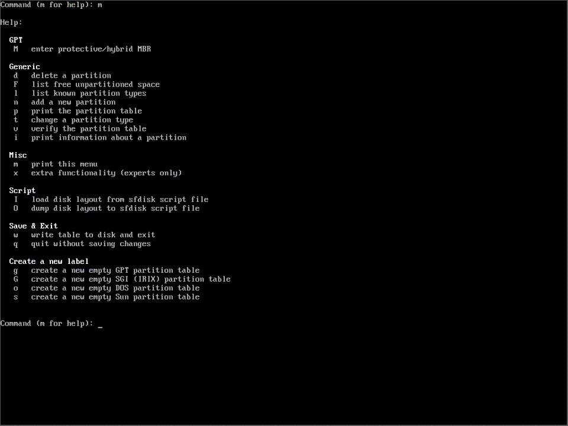

>吐槽：因为之前hexo的tags和categories页面无法正常显示，在配置的过程中一不小心把原来的两篇博客都删掉了。尝试了用windows FileRecovery找了回来，确实是找回来了。
>只不过，找回来的文件都无法正常打开，虽然名称和后缀都对，但是就是无法正常显示，无论是图片还是文字，都不行。只能重写了。这一篇还好，是我不久前写的，但是另一篇是很久之前写的了。
>如果以后还有时间的话，再补回来吧。这回长记性了QAQ


# 安装前
- 下载[Arch Linux](https://archlinux.org/download/)以及制作安装介质（物理机安装）。
- 准备好官方的[安装文档](https://wiki.archlinux.org/title/Installation_guide)。

## UEFI 还是 BIOS+MBR ？
如果不确定自己的电脑是`EFI`启动还是`BIOS+MBR`，可以先进入安装界面，输入
```
ls /sys/firmware/efi/
```
如果有内容输出的话，就是`EFI`，反之就是`BIOS+MBR`。

**注意：这篇文档只会介绍`EFI`启动模式下的安装。**

VMware下，如果想采用`EFI`启动，可以按以下步骤：
- 创建好虚拟机但是不要直接运行；
- 找到你创建的虚拟机目录下的后缀为```*.vmx```文件；
- 用你喜欢的文本编辑器打开，在其中加入：
```
firmware = "efi"
```
这样开始虚拟机之后就是`EFI`启动了。

## **参考**
- [官方安装文档](https://wiki.archlinux.org/title/Installation_guide)
- Bilibili up主：[TheCW](https://space.bilibili.com/13081489) -> [Arch Linux安装视频](https://www.bilibili.com/video/BV11J411a7Tp)

### **几句想说的话**

如果你真的找到了这篇文档，说明你应该像我一样很喜欢折腾这些东西。如果这篇文档真的帮助到你，我会非常开心也会感到非常荣幸。我的很多知识都来源于开源社区无私的分享者们，我也会努力分享我能够分享的一切，希望你也能将开源社区的精神传递下去，谢谢。

---
# 开始
来到启动界面开始安装，进入之后会看到下面的界面：


如果觉得字体比较小看着不舒服，可以输入以下命令调整字体大小：
```
setfont /usr/share/kbd/consolefonts/LatGrkCry-12x22.psfu.gz
```
所有的console字体都放在`/usr/share/kbd/consolefonts/`这个文件夹下，你也可以选择其他你想用的字体。

**网络设置：**

我推荐在安装时插一根网线，方便很多。VMware下就相当于已经为虚拟机插了网线了。如果需要链接Wi-Fi，可以参考以下命令和参考目录下的[视频](https://www.bilibili.com/video/BV11J411a7Tp):
```
ip link show                        # 查看接口名称
ip link set <xxx> up    	        # xxx 就是上一指令中的接口名称
iwlist <xxx> scan | grep ESSID	    # 扫描可用的Wi-Fi链接
wpa_passphrase <wifi_name> <passwd> > internet.conf # 替换成你自己的Wi-Fi名称和密码
wps_supplicant -c internet.conf -i <xxx> &    # 用上一条指令生成的配置文件链接Wi-Fi。
dhcpcd &                            # 运行dhcpcd使我们的网络连接生效
```
现在，我们可以尝试ping一个网址，看看网路是否已经连接好了。
```
ping www.archlinux.org
```
如果有正常的输出，我们的网络就配置好了。注意，一定要有网络连接，我们安装的时候会需要网络。

**更新系统时钟：**
```
timedatectl set-ntp true
```
如果你有其他的需求，比如更换键盘布局，请参考[官方安装文档](https://wiki.archlinux.org/title/Installation_guide)。

## **分区（重要）**

有带有图形界面的分区工具，例如`cfdisk`，我这里还是用`fdisk`。首先，我们输入`fdisk -l`，查看一下我们当前磁盘的名称，如下图所示，我的磁盘名称是`/dev/sda`。

输入`fdisk /dev/sda`，进入`fdisk`开始分区。


如果不熟悉`fdisk`也没关系，可以输入`m`查看使用帮助：



我打算为我的系统分以下四个区:
- /boot：用来作为启动分区，512M
- swap：用来作为虚拟内存，2G
- /：根目录，32G
- /home：家目录（optional），剩余磁盘空间

下面我就根据以上，开始在这个磁盘上制作分区。

首先输入`g`将现在的磁盘变为GPT格式：


之后输入`n`产生一个新的分区，接着分区编号，可以看到从1到128都可以；再之后输入起始位置（默认就好），之后输入终点位置，输入形式为<+Capacity>，例如`+512M`或者`+2G`，一定不要忘记加号。

按照之前我设想的分区，将以上过程重复几遍，如下图所示（我没有按照1234编号，按个人需求配置），这时再输入`p`查看我们刚刚告诉给`fdisk`的分区指令：


可以看到我们分区已经显示出来了，但是这时`fdisk`还没有将这些分区写入，在我们输入写入指令之前，`fdisk`不会更改我们的磁盘。现在输入`w`写入。写入完成后`fdisk`会自动退出，回到root下。

*以下为optional，刚刚已经写入了也没关系*：我们也可以在`fdisk`下更改分区的文件系统，输入`t`告诉`fdisk`我们要更改分区的文件系统，这时`fdisk`会要求我们输入分区的编号，再输入想要改到的文件系统的编号，例如我们更改`/dev/sda1`为`EFI file system`，输入`t`，输入分区编号`1`，再输入文件系统的编号`1`，我们就把`/dev/sda1`从`Linux file system`改为了`EFI file system`。


现在我们可以为我们刚刚写入的分区制作对应的文件系统。在命令行中一次输入以下指令：
```
mkfs.fat -F32 /dev/sda1
mkfs.ext4 /dev/sda3
mkfs.ext4 /dev/sda4
mkswap /dev/sda2
swapon /dev/sda2
```
如果不记得自己的对应分区名称，可以输入`fdisk -l`查看。输入指令时如下图所示：


现在我们将`/mnt`挂载到对应的分区上。输入以下命令：
```
mount /dev/sda3 /mnt
mkdir /mnt/boot
mount /dev/sda1 /mnt/boot
mkdir /dev/sda4 /mnt/home
```

## 真正的安装

安装脚本`Arch Linux`官方已经给我们准备好了，输入以下指令：
```
pacstrap /mnt base linux linux-firmware
```
我建议在这一步后面加上其他比较重要的的软件包，例如文本编辑器（vi/vim/nano/emacs），网络配置工具（dhcpcd，wpa_supplicant）等。

其实在这之前会有教程提示说更改源，不过最新的arch linux安装的时候会自动把离你最近的源放到最前，不需要再更改了。

输入以上命令之后，等着安装完成：


## 重要配置

- 首先生成fstab文件
```
genfstab -U /mnt > /mnt/etc/fstab
```
- 现在，我们登录进刚刚安装好的系统：
```
arch-chroot /mnt
```
- 设置区域和时间
```
ln -sf /usr/share/zoneinfo/Asia/Singapore /etc/localtime
```
这里Asia/Singapore可以改成其他的地区，看你自己所在的地理位置。
- 设置硬件时钟
```
hwclock --systohc --utc
```
- 本地化

**这里默认你已经在刚刚安装的时候安装好了一个文本编辑器，如果没有，输入`pcaman -S <your-favoriate-editor>`安装**

打开文件`/etc/locale.gen`
```
Editor=<your-favorite-editor> /etc/locale.gen
```
找到`en_US.UTF8 UTF8`，去掉这一行注释，保存退出后，输入：
```
locale-gen
```
再用<你喜欢的编辑器>打开`/etc/locale.conf`，写入：
```
LANG=en_US.UTF8
```
保存并推出。
- 编辑localhost和hosts

用<你喜欢的编辑器>打开文件`/etc/hostname`，写入：
```
myarch
```
这里这个hostname写啥都行，我就直接写了myarch。保存并推出。

再用<你喜欢的编辑器>打开文件`/etc/hosts`，写入：
```
127.0.0.1   localhost
::1         localhost
127.0.1.1   myarch.localdomain  myarch
```
这里把`myarch`换成你自己刚刚在`hostname`中写入到名称。保存并推出。
- root密码

在命令行中输入
```
passwd
```
创建你的root密码，千万要记住这个密码。

### 安装引导（重要）

输入以下指令安装grub和其他必要的软件包：
```
pacman -S grub efibootmgr intel-ucode os-prober
```
>**注意：如果你在安装双系统的话，再多安装一个`ntfs-3g`。**
>
>**在进行以下步骤之前，找到文件`/etc/default/grub`，在其中加入以下，然后保存退出**
```
GRUB_DISABLE_OS_PROBER=false
```

创建文件夹`/boot/grub`，命令行中输入
```
mkdir /boot/grub
```
生产grub配置文件，命令行中输入：
```
grub-mkconfig > /boot/grub/grub.cfg
```
安装grub-efi引导，命令行中输入：
```
grub-install --target=x86_64-efi --efi-directory=/boot
```
如下图所示：


**如果你再安装系统时还没有安装网路工具，现在一定要安装，否则一会安装完成之后重启，arch没有网络连接。需要的工具在之前有提到。**

```
pacman -S dhcpcd wpa_supplicant
```

### 准备重启

重启之前，先退出这个安装好的系统
```
exit
```
然后把之前`mount`上去的`umount`掉。
```
umount /mnt/boot
umount /mnt/home
umount /mnt
```
输入`reboot`重启


如果出现grub的引导界面：


恭喜！安装正式完成啦！开始玩耍吧！


不过可以看到，现在我们是root用户，而且整个系统没有图形界面。下一篇文档我会写安装图形界面的过程以及添加普通用户。

欢迎加入[Arch](https://www.archlinux.org)。