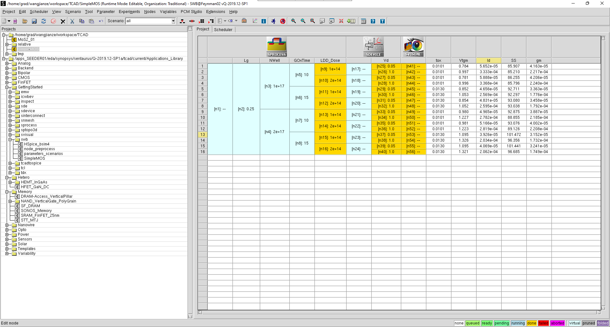

# Tutorial for Sentaurus (Synopsys)

## Sentaurus workbench

### Starting Sentaurus

```sh
$ cd <workspace_folder>
$ module load singularity
$ singularitysetup_sentaurus
$ tcsh
$ load_sentaurus
$ setenv STDB <project_folder>
$ swb &
```

### Running Project


The tool flow refers to the sequence of simulation tools and their associated input files. 
In the SimpleMOS example, these are `Sentaurus Process`, `Sentaurus Device`, and `Svisual` as seen in Figure 1. 
Below the tool flow, the project parameters (Lg, NWell, and so on) and the corresponding simulation nodes ([n1], [n2], and so on) are listed.

To display node numbers: **`View > Tree Options > Show Node Numbers`** (or press the `F9` key).

A complete sequence of simulation nodes (comprising all tools in the tool flow) form an experiment. 
In other words, an experiment is a complete horizontal line in the table view. 
Any number of experiments is possible for a given tool flow if parameters are used.

To the right of the tool flow, there are variables and extracted electrical parameters from the simulated Id–Vg characteristics:
Tox, Vtgm, Id, SS, gm (use the scroll bar to see them all). 
When the simulation is completed, the extracted electrical values appear in their respective columns.
